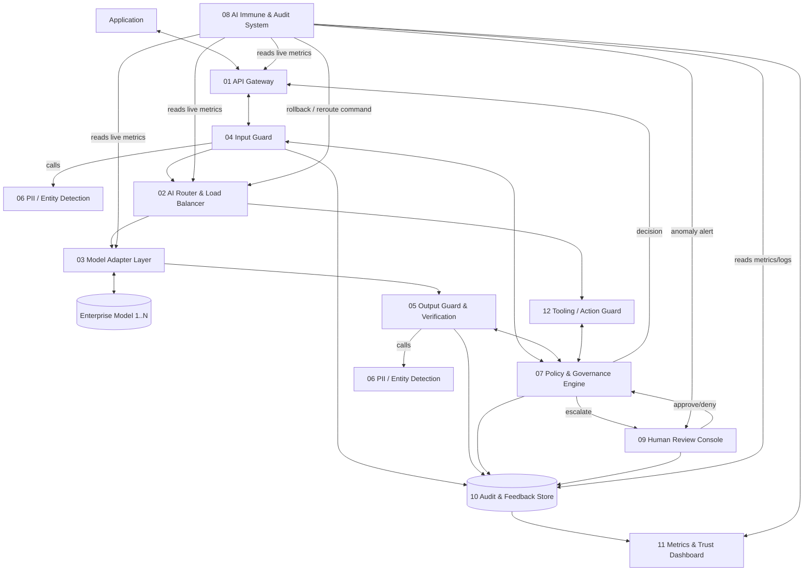
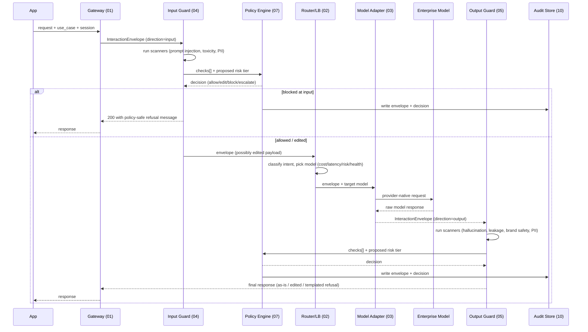
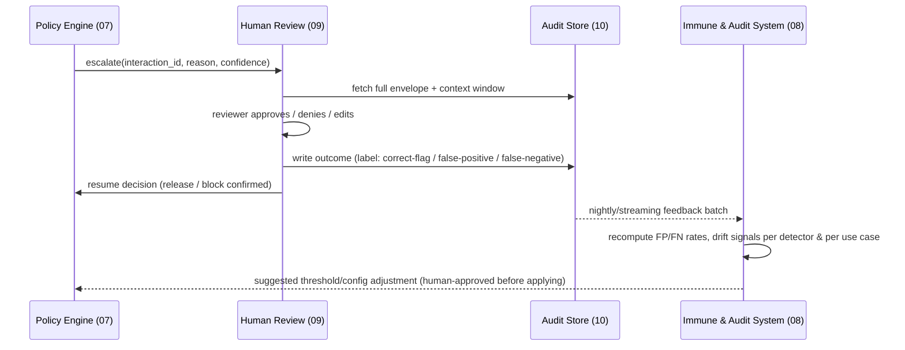

# ControlPlane.ai — System Flow & Architecture

## 1. Expanded architecture (Round 2)



This is the same shape as the Round‑1 diagram (Application → Gateway → Firewall → Router → Enterprise Models, wrapped by the Immune & Audit System, escalating to Human Review) with three additions the Round‑2 brief calls for explicitly: a **Policy & Governance Engine** as the actual decision brain (Round 1 implied this inside "AI Firewall"; Round 2's emphasis on configurable, auditable decision logic earns it its own box), a **PII/Entity Detection** service shared by both directions of the Firewall, and an **Audit & Feedback Store** + **Metrics Dashboard** so the "feedback loops" and "metrics & monitoring" solutioning areas are real components, not slideware.

## 2. Shared data contract — `InteractionEnvelope`

Every component reads and/or writes this object. Treat it as the interface contract the team agrees on **before** writing service code — it's what lets 01–12 be built in parallel.

```json
{
  "interaction_id": "uuid-v4",
  "session_id": "uuid-v4",
  "parent_interaction_id": "uuid-v4 | null",
  "use_case": "customer_support | internal_copilot | decision_support",
  "geography": "US | EU | IN | ...",
  "created_at": "ISO-8601",
  "latency_budget_ms": 800,
  "direction": "input | output",
  "payload": {
    "role": "user | assistant | tool",
    "content": "string",
    "attachments": []
  },
  "model": {
    "requested": "string | null",
    "routed_to": "string | null",
    "provider": "string | null",
    "adapter_version": "string"
  },
  "risk": {
    "tier": "low | medium | high",
    "confidence": 0.0
  },
  "checks": [
    {
      "check_name": "prompt_injection | toxicity | pii | hallucination | brand_safety | secret_leakage | ...",
      "engine": "llm-guard | presidio | judge-model | retrieval-verify | custom",
      "engine_version": "string",
      "score": 0.0,
      "verdict": "pass | warn | fail",
      "latency_ms": 0,
      "details": {}
    }
  ],
  "decision": {
    "action": "allow | edit | flag | block | escalate | reroute",
    "reason": "string",
    "policy_version": "string",
    "decided_by": "policy_engine | human:<user_id>",
    "confidence": 0.0
  },
  "tool_calls": [
    {
      "tool_name": "string",
      "arguments": {},
      "guard_verdict": "allow | block | escalate"
    }
  ],
  "metadata": {}
}
```

Notes:
- `direction` distinguishes an input-side envelope (before the model call) from an output-side envelope (after) — the Input Guard and Output Guard both write into `checks[]`, they don't overwrite each other.
- `risk.tier` and `decision` are written by the **Policy & Governance Engine only** — no other component should set `decision.action`. This is the single place that embodies the "decision logic" solutioning area, which matters for auditability.
- Every envelope, regardless of final action, is written to the Audit & Feedback Store (component 10) — "allow" decisions are audited too, since that's what lets you compute false-negative rates later.

## 3. Primary request sequence (happy path + block path)



## 4. Escalation & feedback sequence



This is the literal implementation of "how flagged or overridden cases feed back to improve detection quality over time" from the brief — human labels captured at review time become the ground truth used to tune thresholds, closing the loop the brief says doesn't exist naturally for hallucination/verification.

## 5. Latency budget allocation (example, tune per use case)

| Use case | Total budget | Input Guard | Routing | Model call | Output Guard | Headroom |
|---|---|---|---|---|---|---|
| Customer-facing chatbot (real-time) | 800 ms | 60 ms | 20 ms | 600 ms | 80 ms | 40 ms |
| Internal copilot | 2,500 ms | 150 ms | 30 ms | 2,000 ms | 250 ms | 70 ms |
| Decision-support (batch/regulated) | 10,000 ms | 500 ms | 50 ms | 6,000 ms | 3,000 ms | 450 ms |

This directly operationalizes "different AI use cases... have very different risk tolerance and latency budgets" — the Policy Engine (07) looks up this table by `use_case` and tells each Guard which checks it's allowed to run synchronously vs. defer to async post-hoc audit (see 05 and 08 for the sync/async split).

## 6. Non-functional targets (from the Reference Parameters)

- Design for **tens of thousands of interactions/week** combined across use cases ≈ average 4–6 req/min, but provision for **10–20x burst** (demo days, incident spikes) → target ~20–50 sustained RPS, ~100 RPS burst, across the whole prototype cluster.
- Treat **all upstream data sources as untrusted by default** ("mix of well-governed and loosely governed internal data sources") — the Input Guard and PII service apply the same scrutiny regardless of declared source trust level; a `source_trust` field can lower thresholds but never skip scanning entirely.
- Assume the enterprise **only has API-level access to its models** — no component in this architecture inspects model weights/attention/logprobs beyond what a normal completion API exposes (input/output layer only, per the brief).
